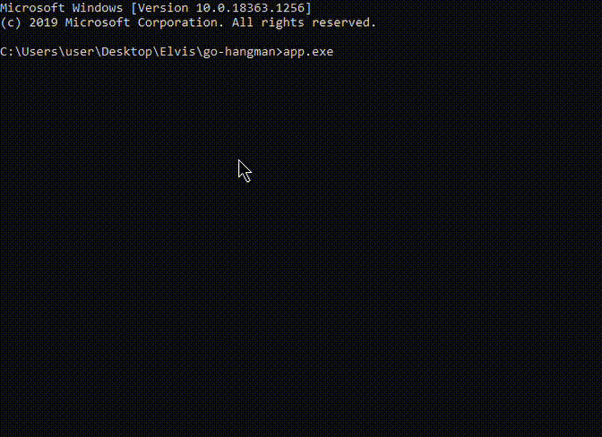

## Hangman game

According to Wikipedia
> Hangman is a paper and pencil guessing game for two or more players. One player thinks of a word, phrase or sentence and the other(s) tries to guess it by suggesting letters within a certain number of guesses.

So I emulated this in golang as a terminal program

